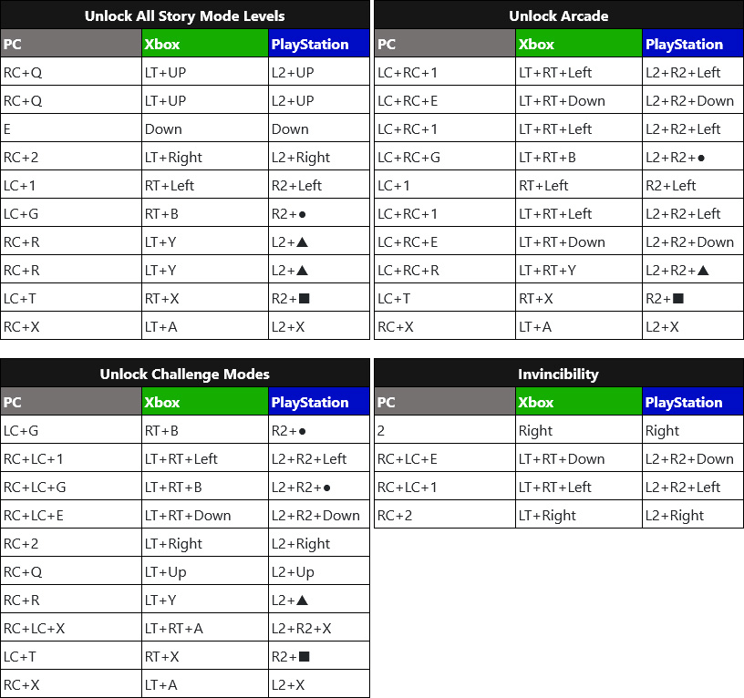

# PlayStation & Xbox TS2 Unlock Codes

Consoles players cannot install TS2 Redux to their consoles, but they can still unlock and enjoy TS2 in its entirety by entering in codes using their controller.

### Instructions
1.  Play through Homefront 2 until you reach the Restricted Zone, the final chapter of the storyline. This may take several hours to do.
2.  Locate the arcade cabinet easter egg, walk up to it, and activate it. If you don't know where the arcade cabinet is, watch one of the guides on YouTube to see how to find it. Once you interact with the arcade cabinet for the first time, a new menu option will appear on Homefront 2's main menu under Extras titled "TimeSplitters 2" where you can easily launch TS2 from then on.
3.  Start TimeSplitters 2. The game's title will appear and you will then see the main menu with "Story" and "Quit".
4.  Enter one of the codes below (from the Codes section) while on the main menu.

### Unlock Codes

*Reminder- if you're on PC and using TS2 Redux, you don't need these codes.*

### Tips For Using Unlock Codes

-   You can enter multiple codes in a row (you're not limited to just one at a time).
-   You do not have to enter the codes fast. The game does not seem to have a time limit on how fast codes must be entered.
-   The game does not accept code presses while on the TS2 "Loading" screen. When switching from the main menu to the story mode missions screen, there is a loading screen in between. While this loading screen is present, make sure you don't press any buttons until it's done loading.
-   Switching between different menus does not interrupt a code. The same code can be performed across different menu screens without the code resetting. In other words, you can start entering a code on the TS2 main menu, then go into story mode menu and back and the code will still work. If a code causes you to exit out to the Homefront 2 menu, that is okay. Just go back into TS2 and your code should still be accepted.
